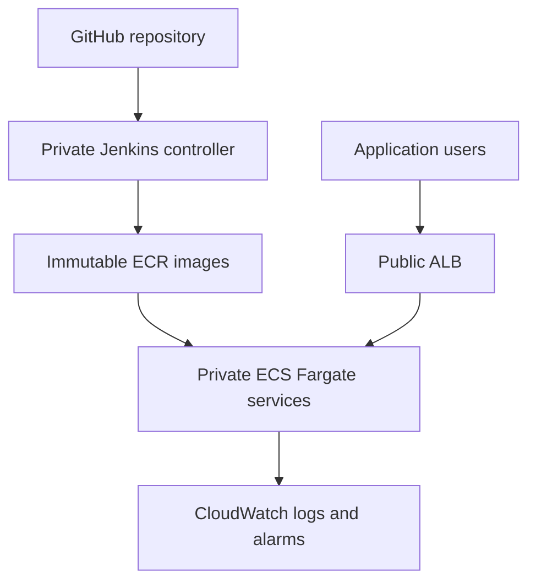

# Production-Style AWS ECS Application Platform

An original platform engineering project that deploys an **ECS Release Console**
to Amazon ECS Fargate and traces every running release back to an immutable Git
commit.

```text
GitHub -> Jenkins -> tests -> Docker -> Amazon ECR -> Amazon ECS -> ALB
```

The repository begins with original application source and a new Git history.
It is not based on a fork. The source is available under the MIT License.

## What this project demonstrates

- Terraform-managed VPC, public and private subnets, NAT, ALB, ECR, ECS, IAM,
  CloudWatch, autoscaling, and a private Jenkins controller
- Two independently deployable ECS services across two Availability Zones
- No public IP addresses or inbound internet access on ECS tasks
- Immutable `sha-<commit>` ECR tags with scan-on-push and lifecycle policies
- Jenkins releases through an EC2 instance role rather than stored AWS keys
- ECS deployment circuit breakers, automated stabilization checks, functional
  smoke tests, and scripted rollback
- Remote Terraform state with S3 versioning, encryption, public-access blocking,
  and native state locking

## Application behavior

The web console calls the API through the same ALB clients use. The API exposes:

| Endpoint | Purpose |
|---|---|
| `/api/health` | API and ALB target health |
| `/api/platform` | Environment, version, service, Git SHA, and timestamp |
| `/health` | Web container and ALB target health |

This turns deployment identity into a testable runtime contract. A pipeline is
not successful merely because an image was pushed; the ALB must return the
expected commit from the deployed API.

## Architecture



The initial cost-conscious lab profile uses one NAT gateway. Setting
`single_nat_gateway = false` creates one NAT gateway per Availability Zone to
remove the cross-AZ egress dependency.

## Delivery gates

| Gate | Outcome | Current repository status |
|---|---|---|
| 0. Ownership | Original source and Git history | Public repository established; original root commit published |
| 1. Application | Type checks, tests, production builds | Locally verified |
| 2. Containers | Non-root images and health contracts | Locally verified through container health and non-root runtime checks |
| 3. Foundation | Network, ECR, ECS, ALB, IAM, logging | AWS deployment verified; workload deployment pending |
| 4. First release | Immutable images running on Fargate | Not yet deployed |
| 5. Automation | Jenkins reproduces a verified release | Implemented; live Jenkins run pending |
| 6. Operations | Failure, alarm, scaling, rollback evidence | Runbook implemented; live exercise pending |

The project intentionally distinguishes **implemented**, **locally verified**,
and **AWS deployment-verified**. See
[deployment evidence](docs/deployment-evidence.md).

## Repository layout

```text
apps/
  api/                       Express and TypeScript metadata API
  web/                       React and TypeScript release console
infrastructure/
  bootstrap-state/           Protected S3 Terraform state bucket
  foundation/                VPC, ECR, ALB, ECS cluster, IAM, logs
  workload/                  Task definitions, services, scaling, alarms
  jenkins/                   Private EC2 controller, SSM, deployment IAM
scripts/
  bootstrap-platform.sh      Ordered first deployment
  build-and-push.sh          Immutable image publication
  deploy-service.sh          New ECS task revision registration
  rollback-service.sh        Explicit task revision rollback
  smoke-test.sh              ALB and deployed-commit verification
Jenkinsfile                  Repeatable application release pipeline
docs/                        Architecture, setup, operations, evidence
```

## Local validation

Requirements: Node.js 22 or newer, npm, Docker, and Docker Compose.

```bash
npm run install:all
npm run validate
docker compose up --build
```

Then verify:

```bash
curl http://localhost:8080/health
curl http://localhost:8080/api/health
curl http://localhost:8080/api/platform
```

Stop the local environment with:

```bash
docker compose down
```

## AWS deployment

Start with the [deployment runbook](docs/deployment-runbook.md). It explains
the prerequisites, remote state bootstrap, Terraform review points, first image
release, workload deployment, and Jenkins setup in dependency order.

The automated bootstrap requires an explicit cost acknowledgment and still
leaves each `terraform apply` interactive:

```bash
export AWS_REGION="us-east-1"
export TF_STATE_BUCKET="replace-with-a-globally-unique-name"
export PROJECT_NAME="ecs-release-console"
export ENVIRONMENT="prod"
export APP_VERSION="0.1.0"
export CONFIRM_AWS_CHARGES="yes"

scripts/check-prerequisites.sh
scripts/bootstrap-platform.sh
```

This environment creates billable AWS resources, including a NAT gateway, ALB,
Fargate tasks, ECR storage, CloudWatch logs, and an EC2 Jenkins controller.
Review every plan and destroy lab resources when they are no longer required.

## Engineering boundary

Terraform owns durable infrastructure and the bootstrap task definitions.
Jenkins owns application releases after bootstrap. The Jenkins pipeline does
not run `terraform apply`, edit network resources, or store long-lived AWS
access keys.

Read:

- [Architecture decision](docs/architecture.md)
- [Implementation workflow](docs/implementation-workflow.md)
- [Deployment runbook](docs/deployment-runbook.md)
- [Jenkins setup](docs/jenkins-setup.md)
- [Operations runbook](docs/operations-runbook.md)
- [Deployment evidence](docs/deployment-evidence.md)
